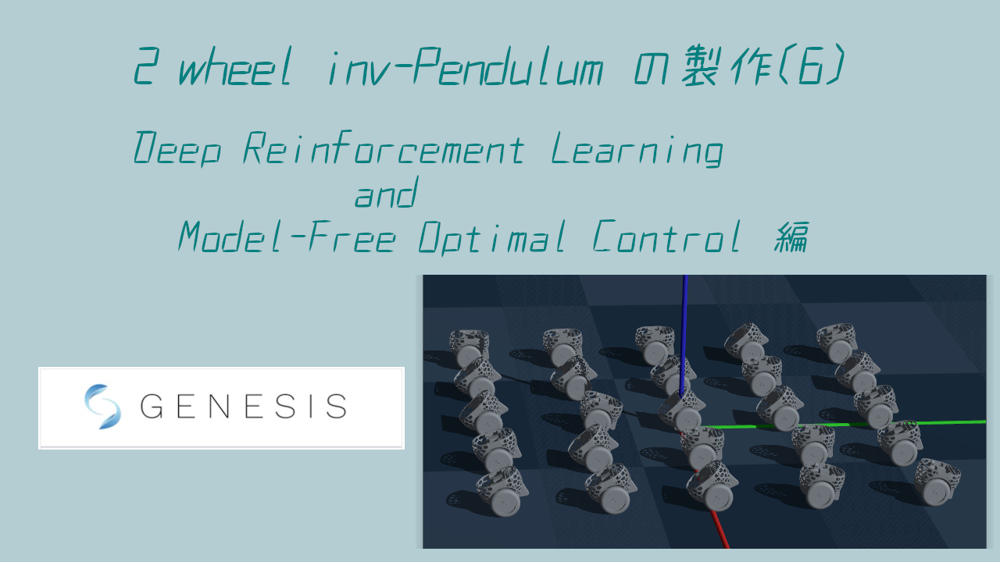
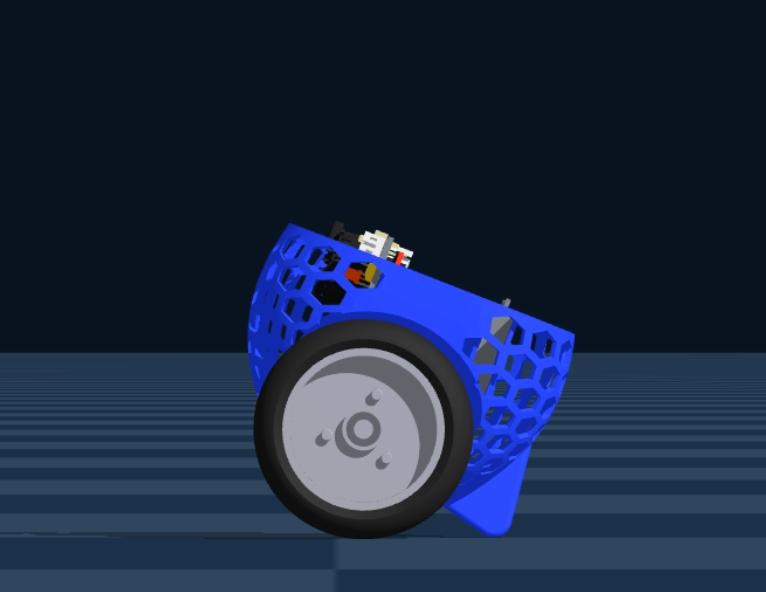
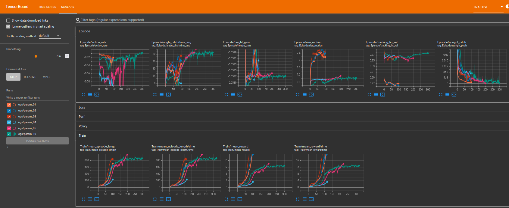

## Reinforcement learning file for a two-wheeled inverted pendulum running in the Genesis environment 
 
This file is a repository of deep reinforcement learning training files explained in the YouTube video "Deep Reinforcement Learning and Model-Free Optimal Control in Genesis Simulator." It is intended for use with the "Genesis" physics platform. 
 
For the YouTube explanation, please refer to the following URL: 
https://www.youtube.com/watch?v=me3NUO_06fw 
 
 
About the file contents: 
- Inverted control of a two-wheeled inverted pendulum model is performed using deep reinforcement learning in the Genesis simulation environment. 
- A reinforcement learning reward function that achieves "model-free optimal control" is created and demonstrated. 
- A reward structure that explores the inverted posture based on interaction with the environment is implemented. 
 
The following three files are used for reinforcement learning in Genesis. 
1. env.py (Environment Definition File) 
: Defines the environment in which the reinforcement learning agent interacts. 
2. train.py (Training Executable File) 
: This is the main script that trains the agent using the reinforcement learning algorithm. 
3. eval.py (Evaluation/Test File) 
: This is a script for evaluating the performance of a trained model. 
 
Please download the robot model file (URDF) from the repository below. 
https://github.com/hir4484/inverted_pendulum_sim_in_Genesis 
You'll find this model file in the pendulum_robot_renew folder. 
 
 
To run training, use the following command: 
~$ python3 pend5_train.py 
 
When running evaluation after training, you can record the screen by adding an option to the eval file. 
To record: 
~$ python3 pend5_eval.py -R 
~$ python3 pend5_eval.py --record 
To not record: 
~$ python3 pend5_eval.py 
 
To start TensorBoard: 
~$ tensorboard --logdir=./ 
 
 
Copyright (c) 2025/Nov/09, hir (hir4484@gmail.com). Available under the MIT License.
